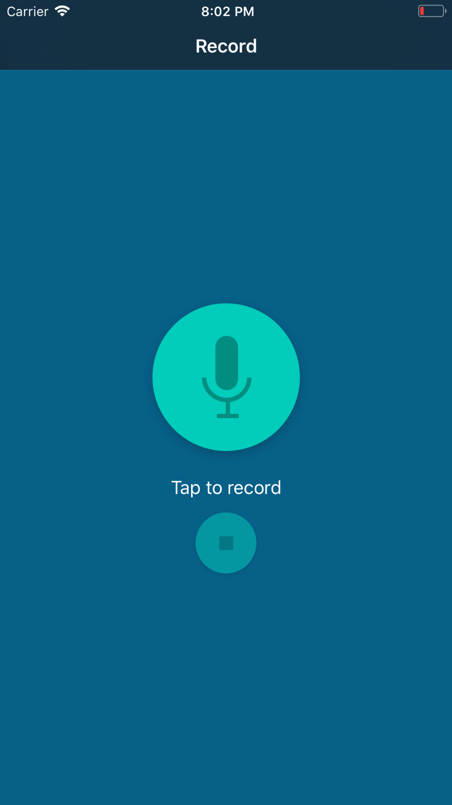
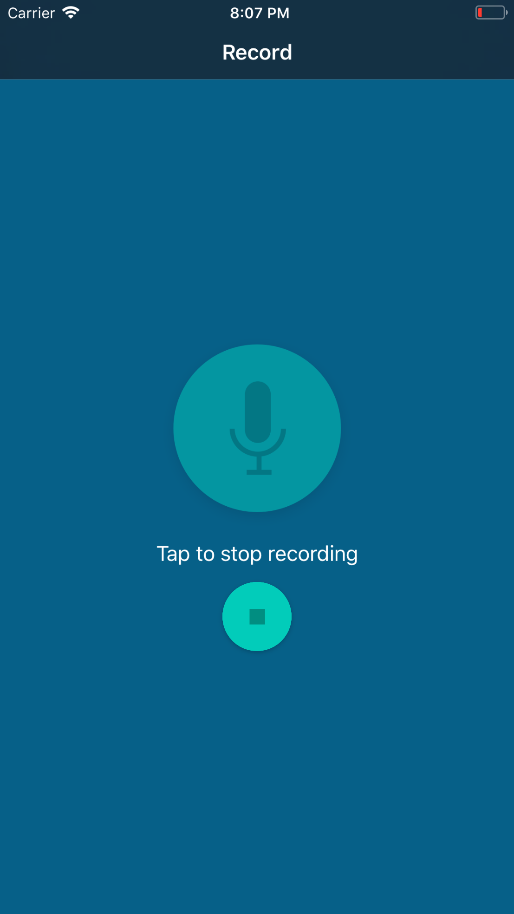
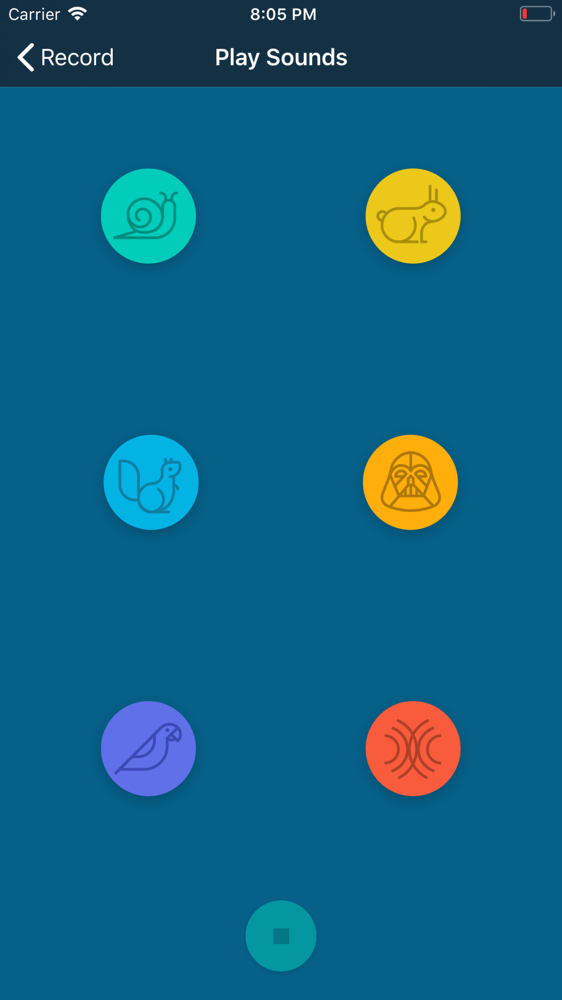

# Pitch-perfect
This is the first Udacity iOS course assignment. An iOS app that records a conversation and plays it back to you applying some really cool modulations.

# Requirements
Swift 3+  
iOS 10+

# App Features
Record sounds from your device's microphone and apply any of the the following modulations:

<ul>
  <li>Fast</li>
  <li>Slow</li>
  <li>High Pitch</li>
  <li>Low Pitch</li>
  <li>Echo</li>
  <li>Reverb</li>
</ul>
